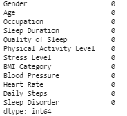

# Laporan Proyek Machine Learning
### Nama : Muhamad Iqbal
### Nim : 211351088
### Kelas : Pagi B

## Domain Proyek

Proyek ini dirancang untuk melakukan analisis guna mengidentifikasi apakah seseorang mengalami gangguan tidur atau tidak. Melalui pendekatan analisis data, proyek ini bertujuan untuk memberikan pemahaman mendalam tentang faktor-faktor yang dapat mempengaruhi gangguan tidur dan mengembangkan model prediktif yang dapat memproyeksikan kemungkinan adanya gangguan tidur pada setiap orang.

## Business Understanding

Dapat memprediksi dan membantu pengguna memproyeksikan kemungkinan adanya gangguan tidur.

Bagian laporan ini mencakup:

### Problem Statements

- Keterbatasan dalam memprediksi dini kemungkinan gangguan tidur
- Bagaimana kualitas tidur dan pola tidur seseorang dapat mengganggu kualitas tidur sehingga mengalami gangguan tidur

### Goals

- Melakukan analisis terhadap faktor-faktor penyebab, seperti kebiasaan tidur, lingkungan tidur, dan gaya hidup, yang dapat berkontribusi pada gangguan tidur.
- Menetapkan standar kualitas tidur yang cukup berdasarkan produktivitas kerja yang optimal dan kesehatan fisik

### Solution statements

   - Mengembangkan model prediktif untuk memproyeksikan risiko gangguan tidur pada individu sehingga meningkatkan kesadaran seseorang tentang pentingnya kesehatan tidur
   - Mengembangkan model machine learning dengan menggunakan model decision tree

## Data Understanding
Menggunakan dataset yang berasal dari kaggle yang berisi tingkat kesehatan tidur seseorang. terdiri dari 374 baris dan 12 kolom, yang mencakup berbagai variabel yang berkaitan dengan tidur dan kebiasaan sehari-hari.<br> 

[Sleep Health and Lifestyle Dataset](https://www.kaggle.com/datasets/uom190346a/sleep-health-and-lifestyle-dataset/data)

Selanjutnya kita akan menguarikan seluruh variabel atau fitur pada data :

### Variabel-variabel pada Sleep Health and Lifestyle Dataset adalah sebagai berikut:
- Gender: Jenis kelamin orang tersebut (Male/Female).
- Age: Usia orang tersebut dalam tahun.
- Occupation: Pekerjaan atau profesi orang tersebut.
- Sleep Duration (hours): Jumlah jam orang tersebut tidur per hari.
- Quality of Sleep (skala: 1-8): Penilaian subjektif dari kualitas tidur, mulai dari 1 hingga 10.
- Physical Activity Level (menit/hari): Jumlah menit orang tersebut melakukan aktivitas fisik setiap hari.
- Stress Level (skala: 1-10): Penilaian subjektif dari tingkat stres yang dialami oleh orang tersebut, mulai dari 1 hingga 10.
- BMI Category: Kategori BMI orang tersebut (misalnya, Underweight, Normal, Overweight).
- Blood Pressure (systolic/diastolic): Pengukuran tekanan darah seseorang, yang ditunjukkan sebagai tekanan sistolik atau tekanan diastolik.
- Heart Rate (bpm): Denyut jantung istirahat seseorang dalam denyut per menit.
- Daily Steps: Jumlah langkah yang dilakukan seseorang per hari.
- Sleep Disorder: Ada atau tidaknya gangguan tidur pada orang tersebut (Tidak Ada, Insomnia, Sleep Apnea).

## Data Preparation

## Data Collection

Data yang digunakan yaitu berasal dari website kaggle menggunakan dataset dengan nama Sleep Health and Lifestyle Dataset.

## Data Discovery and Profiling

Dikarnakan menggunakan google collab maka harus mengimport file dan mengupload token yang di download dari kaggle terlebih dahulu agar bisa mendownload file dataset dari kaggle melalui google colab

```bash
from google.colab import files
files.upload()
```

Setelah mengupload token, selanjutnya kita akan membuat folder untuk menyimpan file kaggle.json yang sudah diupload

```bash
!mkdir -p ~/.kaggle
!cp kaggle.json ~/.kaggle/
!chmod 600 ~/.kaggle/kaggle.json
!ls ~/.kaggle
```
Sudah berhasil, langkah selanjutnya kita download datasetnya

```bash
!kaggle datasets download uom190346a/sleep-health-and-lifestyle-dataset
```

mari kita extract file yang telah di download tadi

```bash
!mkdir sleep-health-and-lifestyle-dataset
!unzip sleep-health-and-lifestyle-dataset.zip -d sleep-health-and-lifestyle-dataset
!ls sleep-health-and-lifestyle-dataset
```
setelah proses extract selesai, mari kita import library yang dibutuhkan

```bash
import pandas as pd
import numpy as np
import matplotlib.pyplot as plt
import seaborn as sns
from mlxtend.preprocessing import minmax_scaling
from scipy import stats
```

### Data Discovery
setelah itu kita masukkan file csv yang telah diextract pada sebuah variabel

```bash
df= pd.read_csv('sleep-health-and-lifestyle-dataset/Sleep_health_and_lifestyle_dataset.csv')
```

kita lihat 5 baris teratas pada dataset kita

```bash
df.head()
```


kita drop Person ID karena tidak diperlukan
```python
df = df.drop(['Person ID'], axis=1)
```
kita lihat type data pada masing-masing kolom yang ada di dataset kita
```bash
df.info()
```


selanjutnya kita lihat rangkuman statistik deskriptif dari dataset kita


lalu kita ambil salah satu sample acak dari dataset kita
```python
df.sample()
```


lalu kita akan periksa apakah terdapat baris yang kosong atau null pada dataset kita
```bash
df.isna().sum()
```


kita lihat juga kolom categorical dan numerical pada dataset kita
```python
numerical = []
catgcols = []

for col in df.columns:
  if df[col].dtype=="float64":
    numerical.append(col)
  else:
    catgcols.append(col)

  for col in df.columns:
    if col in numerical:
      df[col].fillna(df[col].median(), inplace=True)
    else:
      df[col].fillna(df[col].mode(), inplace=True)
```

```python
numerical
```


```python
catgcols
```


kita lihat orang yang mengalami sleep apnea, insomnia dan yang tidak
```python
df['Sleep Disorder'].value_counts()
```


kita urutkan hasil pengelompokan berdasarkan nilai kolom 'count' secara menurun (descending).
```python
grouped_data.sort_values(by='count',ascending=False)
```


### EDA
kita lihat korelasi antar kolom
```python
corr = df.corr().round(2)
plt.figure(figsize = (7,5))
sns.heatmap(corr, annot = True, cmap = 'YlOrBr')
```


kita lihat distribusi dari variabel gender, BMI Category dan Sleep Disorder
```python
plt.figure(figsize = (9, 10))

plt.subplot(2, 2, 1)
plt.gca().set_title('Variable Gender')
sns.countplot(x = 'Gender', palette = 'Set2', data = df)

plt.subplot(2, 2, 2)
plt.gca().set_title('Variable BMI Category')
sns.countplot(x = 'BMI Category', palette = 'Set2', data = df)

plt.subplot(2, 2, 3)
plt.gca().set_title('Variable Sleep Disorder')
sns.countplot(x = 'Sleep Disorder', palette = 'Set2', data = df)
```


kita lihat distribusi dari variabel occupation
```python
plt.figure(figsize = (20, 10))

plt.subplot(2, 1, 1)
plt.gca().set_title('Variable Occupation')
sns.countplot(x = 'Occupation', palette = 'Set2', data = df)
```


Analisis variabel Sleep Disorder berdasarkan Gender
```python
plt.figure(figsize = (20, 10))
plt.suptitle("Analysis Of Variable Sleep Disorder",fontweight="bold", fontsize=20)

plt.subplot(2, 1, 1)
plt.gca().set_title('Variable Gender')
sns.countplot(x = 'Gender', hue = 'Sleep Disorder', palette = 'Set2', data = df)
```


Analisi variable sleep disorder berdasarkan blood pressure
```python
plt.figure(figsize = (20, 10))
plt.subplot(2, 1, 2)
plt.gca().set_title('Variable Blood Pressure')
sns.countplot(x = 'Blood Pressure', hue = 'Sleep Disorder', palette = 'Set2', data = df)
```


selanjutnya kita lihat variabel yang ada di Occupation
```python
plt.figure(figsize = (20, 10))

plt.subplot(2, 1, 1)
plt.gca().set_title('Variable Occupation')
sns.countplot(x = 'Occupation', palette = 'Set2', data = df)
```


## Preprocessing
mari kita pisahkan fitur dan target
```python
ind_col = [col for col in df.columns if col != 'Sleep Disorder']
dep_col = 'Sleep Disorder'
```

```python
x = df[ind_col]
y = df[dep_col]
```
 kita lihat apakah ada nilai null dalam dataset kita
 ```python
 total_null = df.isnull().sum().sort_values(ascending = False)
percent = ((df.isnull().sum()/df.isnull().count())*100).sort_values(ascending = False)
print("Total records = ", df.shape[0])

missing_data = pd.concat([total_null,percent.round(2)],axis=1,keys=['Total Missing','In Percent'])
missing_data
 ```
 

 jika tidak ada kita lanjut ke tahap selanjutnya
 yaitu mengubah nilai 'Normal Weight' diubah menjadi 'Normal' pada kolom 'BMI Category'.

 ```python
 def fix_BMI (x):
    if x == 'Normal Weight':
        return 'Normal'
    return x

df['BMI Category'] = df['BMI Category'].apply(lambda x : fix_BMI(x))
 ```

 selanjutnya proses transformasi data dari object ke int64
 ```python
 from sklearn.preprocessing import LabelEncoder
l1=LabelEncoder()
df["Gender"]=l1.fit_transform(df["Gender"])
df["Age"]=l1.fit_transform(df["Age"])
df["Occupation"]=l1.fit_transform(df["Occupation"])
df["BMI Category"]=l1.fit_transform(df["BMI Category"])
df["Blood Pressure"]=l1.fit_transform(df["Blood Pressure"])
df["Heart Rate"]=l1.fit_transform(df["Heart Rate"])
df["Sleep Disorder"]=l1.fit_transform(df["Sleep Disorder"])
df
 ```

 

 kita pisahkan antara fitur dengan target
 ```python
 features = ['Gender', 'Age', 'Occupation', 'Sleep Duration', 'Quality of Sleep',	'Physical Activity Level', 'Stress Level', 'BMI Category', 'Blood Pressure', 'Heart Rate', 'Daily Steps']
x = df[features]
y = df['Sleep Disorder']
print(x.shape)
print(y.shape)
 ```
 

 kini terdapat 374 baris dan 11 kolom
 
 selanjutnya kita save model yang telah kita ubah tadi
 ```python
 df.to_csv('sleep-health.csv', index=False)
 ```
## Modeling
```python
from sklearn.model_selection import train_test_split

x_train, x_test, y_train, y_test = train_test_split(x, y, test_size=0.20, random_state=0)

from sklearn.metrics import accuracy_score, confusion_matrix, classification_report
from sklearn.tree import DecisionTreeClassifier
from sklearn import tree

dtc = DecisionTreeClassifier(
    ccp_alpha=0.0, class_weight=None, criterion='entropy',
    max_depth=4, max_features=None, max_leaf_nodes=None,
    min_impurity_decrease=0.0, min_samples_leaf=1,
    min_samples_split=2, min_weight_fraction_leaf=0.0,
    random_state=42, splitter='best'
)

model = dtc.fit(x_train, y_train)

dtc_acc = accuracy_score(y_test, dtc.predict(x_test))

print(f"akurasi data training = {accuracy_score(y_train, dtc.predict(x_train))}")
print(f"akurasi data testing = {dtc_acc} \n")

print(f"confusion matrix : \n{confusion_matrix(y_test, dtc.predict(x_test))}\n")
confusion = confusion_matrix(y_test, dtc.predict(x_test))
print(f"classification report : \n {classification_report(y_test, dtc.predict(x_test))}")
```


Akurasi Data Training: 92.31% dan Akurasi Data Testing: 90.67% <br>
menandakan bahwa model yang kita gunakan memberikan kinerja yang baik pada data training dan testing, dengan skor akurasi yang tinggi. 

- Interpretasi confusion matrix:

- Untuk kelas 1, terdapat 16 instansi yang diprediksi dengan benar, 2 instansi diprediksi sebagai kelas 2, dan 2 instansi diprediksi sebagai kelas 3.
- Untuk kelas 2, terdapat 1 instansi diprediksi sebagai kelas 1, 40 instansi diprediksi dengan benar, dan 0 instansi diprediksi sebagai kelas 3.
- Untuk kelas 3, terdapat 1 instansi diprediksi sebagai kelas 1, 1 instansi diprediksi sebagai kelas 2, dan 12 instansi diprediksi dengan benar.
## Simulasi Model
```python
input_data = (1,14,3,7.6,4,15,2,0,15,4,18)

input_data_as_numpy_array = np.array(input_data)

input_data_reshape = input_data_as_numpy_array.reshape(1,-1)

prediction = model.predict(input_data_reshape)
print(prediction)

if prediction[0] == 1:
    print('Pasien Tidak Mengalami Sleep Disorder')
elif prediction[0] == 2:
    print('Pasien Mengalami Sleep Apnia')
else:
    print('Pasien Mengalami Insomnia')
```


## Visualisasi Hasil Algoritma
```python
import matplotlib.pyplot as plt
fig = plt.figure(figsize=(30,20))
_ = tree.plot_tree(model,
                   feature_names=ind_col,
                   class_names=['non', 'sleep apnea', 'insomnia'],
                   filled=True)
```


## Evaluation
Pada bagian ini kita menggunakan F1 Score sebagai metric evaluasi<br>

F1 Score adalah metrik evaluasi yang menggabungkan presisi (precision) dan recall. F1 Score memberikan suatu nilai yang mencerminkan keseimbangan antara kedua metrik tersebut, dan seringkali digunakan ketika kelas-kelas yang dievaluasi memiliki distribusi yang tidak seimbang.

Rumus F1 Score dinyatakan sebagai:


kita implementasikan rumus tersebut menggunakan metode classification


classification report memberikan gambaran yang bagus tentang performa model klasifikasi untuk setiap kelas, serta metrik rata-rata untuk seluruh dataset. Model ini menunjukkan hasil yang baik dengan tingkat akurasi sekitar 91%.


## Deployment
[Aplikasi Prediksi Sleep Disorder](https://sleep-disorder.streamlit.app/)


